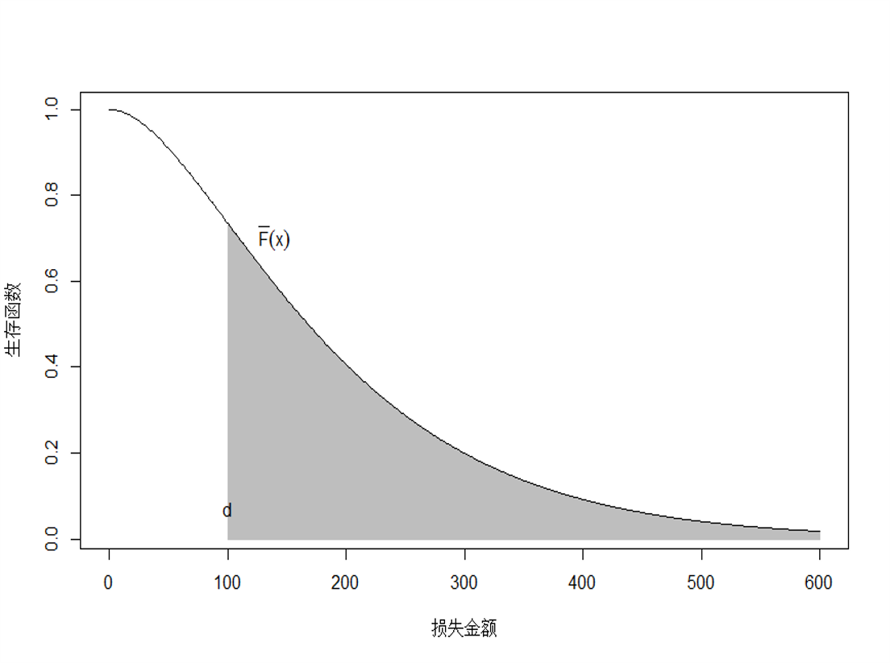
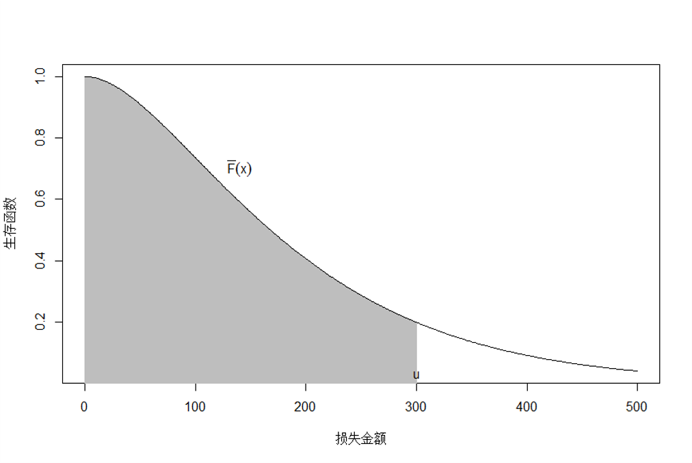

---
output:
  pdf_document: default
  html_document: default
---

# 基本的风险模型 {#riskmod}

**学习目标**：

- 掌握随机变量的概率/密度函数、分布函数等

- 掌握概率母函数/矩母函数

- 


<!-- ## 风险度量的相关概念 -->

<!-- ## 风险单位 -->

<!-- - 风险单位（exposure，unit of exposure）是对风险进行度量的基本单位，也是非寿险精算中费率定价的基本单位。 -->
<!-- 不同险种有不同的风险单位。 -->

<!-- - 风险单位数（exposures, number of exposures），有时也称作风险基础（exposure base）、风险规模或风险暴露，它描述了风险的总体规模。例如，商业汽车保险中，风险单位通常被确定为“车年”，即为 1 辆车提供 1 年的保险，此时风险单位数为 1 个车年。 -->
<!-- 如果为 5 辆汽车提供半年的保险，此时风险单位数为 2.5 个车年。 -->

<!-- - 风险单位数的统计指标主要包含三种： -->

<!--   - 承保风险(written exposures)：在一定时期内保险人已经签订了保险合同的风险单位数 -->

<!--   - 到期风险(earned exposures)：在一定时期内保险人实际承担了保险责任的风险单位数 -->

<!--   - 有效风险(in-force exposures)：在某一时点上保险人正在承担保险责任的风险单位数。 -->


<!-- 例：表展示了 4 份保险期限均为 12 个月的保险单的承保风险、到期风险和有效风险单位数。 -->

<!-- | 生效日期    | 承保风险 |      | 到期风险 |      | 有效风险   | -->
<!-- |---------|------|------|------|------|--------| -->
<!-- |         | 2002 | 2003 | 2002 | 2003 | 1/1/03 | -->
<!-- | 1/1/02  | 1    | 0    | 1    | 0    | 0      | -->
<!-- | 4/1/02  | 1    | 0    | 0.75 | 0.25 | 1      | -->
<!-- | 7/1/02  | 1    | 0    | 0.5  | 0.5  | 1      | -->
<!-- | 10/1/02 | 1    | 0    | 0.25 | 0.75 | 1      | -->
<!-- | 合计      | 4    | 0    | 2.5  | 1.5  | 3      | -->

## 风险与随机变量

**风险**是指在某一特定环境下，在某一特定时间段内，某种损失发生的可能性。风险通常具有以下 7 个主要特征。

- 风险存在的客观性。风险是客观存在的，是不以人的意志为转移的。风险的客观性是保险产生和发展的自然基础。人们只能在一定的范围内改变风险形成和发展的条件，降低风险事故发生的概率，减少损失程度，而不能彻底消除风险。

- 风险的损失性。风险发生后必然会给人们造成某种损失，然而对于损失的发生人们却无法预料和确定。人们只能在认识和了解风险的基础上严防风险的发生和减少风险所造成的损失，损失是风险的必然结果。

- 风险损失发生的不确定性。风险是客观的、普遍的，但就某一具体风险损失而言其发生是不确定的，是一种随机现象。例如，火灾的发生是客观存在的风险事故，但是就某一次具体火灾的发生而言是不确定的，也是不可预知的，需要人们加强防范和提高防火意识。

- 风险存在的普遍性。风险在人们生产生活中无处不在、无时不有，并威胁着人类的生命和财产的安全，如地震灾害、洪水、火灾、意外事故的发生等。随着人类社会的不断前进和发展，人类将面临更多新的风险，风险事故造成的损失也可能越来越大。

- 风险的社会性。没有人和人类社会，就谈不上风险。风险与人类社会的利益密切相关，时刻关系着人类的生存与发展，具有社会性。随着风险的发生，人们在日常经济和生活中将遭受经济上的损失或身体上的伤害，企业将面临生产经营和财务上的损失。

- 风险发生的可测性。单一风险的发生虽然具有不确定性，但对总体风险而言，风险事故的发生是可测的，即运用概率论和大数法则对总体风险事故的发生是可以进行统计分析的，以研究风险的规律性。风险事故的可测性为保险费率的厘定提供了科学依据。

- 风险的可变性。世间万物都处于运动、变化之中，风险也是如此。风险的变化，有量的增减，有质的改变，还有旧风险的消失和新风险的产生。风险因素的变化主要是由科技进步、经济体制与结构的转变、政治与社会结构的改变等方面的变化引起的。


通常根据保险业务不同（寿险业务和非寿险业务），保险风险的具体对象有不同的含义：

- **寿险业务**是指人身为保险标的的保险，包括长期寿险（含年金保险）业务、长期健康险业务以及长期意外险业务。其中的保险风险通常包括：

    - 死亡、伤残等发生的风险
  
    - 费用风险
    
    - 退保风险

- **非寿险业务**通常指财产险业务，通常为短期险种，主要包括保险期间为一年或一年以内的 财产保险、责任保险、短期意外险、短期健康险和短期寿险。保险风险通常包括

    - 保费风险
    
    - 准备金风险
    
    - 巨灾风险


随机变量是描述不确定性的重要数学工具，因此风险可以用随机变量来表示。
随机变量是指取值依赖于随机现象的观察结果的变量，取值是随机的，取值特征通过概率分布来描述。一般用大写的英文字母表示。随机变量可以表示为：

- **连续型随机变量**。其取值通常布满一个区间，如保险事故造成的损失金额 $X$ 的取值范围为 $(0,+\infty)$。

- **离散型随机变量**。其取值为有限个或可列个值，如保险事故发生的次数 $N$ 的取值范围为 $0, 1, 2, 3, ...$。保险事故是否发生损失可以表示为取值为 0 和 1 的离散型变量 $I=0,1$。

- **半连续型随机变量**。其取值通常为连续型和离散型的结合，如保险事故造成的累积损失 $S$，其取值范围为 $[0, +\infty$，其中 $S=0$ 表示保险事故没有造成损失，$S>0$ 表示保险事故造成了多大的损失。


Table: (\#tab:mylabel) 寿险和非寿险业务的区别

| 寿险业务                     | 非寿险业务                           |
|--------------------------|----------------------------------|
| 业务比较稳定             | 业务极其不稳定                   |
| 保险金的给付具有可预期性 | 理赔频率和赔付额具有很强的随机性 |
| 保险业务具有长期性       | 业务多位短期险种     

<!-- 在保险风险度量中，风险可以是： -->

<!-- - 保险事故发生与否的不确定性 -->

<!-- - 保险事故发生的时间的不确定性 -->

<!-- - 保险事故发生的地点的不确定性 -->

<!-- - 保险事故造成的损失金额的不确定性。 -->


-------------

## 分布函数和生存函数

- 连续型随机变量 $X$ 的累积分布函数 (Cumulative Distribution Function, cdf) 表示为 $$F_{X}(x)=\Pr(X\le X)$$

> 例: 运用 R 软件画出下面两种分布函数图。

```{=tex}
\begin{equation*}
F_1(x) = \begin{cases}
0 &\quad x <0,\\
0.01x & \quad 0 \le x < 100,\\
1, & \quad x\ge 100.
\end{cases}
\end{equation*}
```


```{r, plot-cdf, eval = TRUE, echo = TRUE}
# 定义分布函数
F1.f <- function(x) {
  if (x < 0){
    out <- 0
  } else if(x < 100 & x >= 0){
    out <- 0.01*x
  } else if (x >= 100){
    out <- 1
  }
  return(out)
}
F1.f <-  Vectorize(F1.f) # 将函数向量化，允许函数输入向量，输出向量

x <- seq(from = 0, to = 100, length.out = 20) # 画图横轴数据
y <- F1.f(x)  # 画图纵轴数据
plot(x, y, type = 'l', col = "blue", lwd = 2)
```

$$
\begin{equation}
F_2(x) = \begin{cases}
0 &\quad x <0,\\
1 - \left(\frac{2000}{x + 2000}\right)^3, & \quad x\ge 0,
\end{cases}
\end{equation}
$$

```{r, plot-pdf, eval = TRUE, echo = TRUE}
F2.f <- function(x) {
  if (x < 0){
    out <- 0
  } else if (x >= 0){
    out <- 1 - (2000/(2000 + x))^3
  }
  return(out)
}
F2.f <-  Vectorize(F2.f)


x <- seq(from = 0, to = 3000, length.out = 100)
y <- F2.f(x)
plot(x, y, type = 'l', col = "blue", lwd = 2)
```

- 随机变量的生存函数 (Survival Function) 定义为： 
$$
S_{X}(x)=\Pr(X>x)=1-F_{X}(x)
$$
其中，生存函数表示随机变量 $X$ 大于 $x$ 的概率。

- 若随机变量是连续的，其密度函数和生存函数存在下述关系： $$S_{X}(x)=\int_{0}^\infty f_{X}(x)dx$$

$$f(x)=-\frac{dS(x)}{dx}$$

> 例：运用 R 软件画出 **F2.f** 对应的密度函数图。

```{r, eval = TRUE, echo = TRUE}
f2.f <- function(x){
  if (x > 0){
    out <- 3*(2000)^3/(x + 2000)^4
  } else out <- 0
  return(out)
}
f2.f <- Vectorize(f2.f)

x <- seq(from = 0.001, to = 3000, length.out = 100)
y <- f2.f(x)
plot(x, y, type = 'l', col = "blue", lwd = 2)
```

-------------

## 概率母函数/矩母函数 

- 随机变量的概率母函数或矩母函数与其分布函数存在一一对应的关系，同样可以描述随机变量的随机特征。

  - 离散型随机变量： 概率母函数 (Probability Generating Function, pgf) 
  
  - 连续性随机变量： 矩母函数 (Moment Generating Function, mgf)

- 概率母函数或矩母函数可以得到随机变量各阶矩。


> 定义：离散随机变量 $N$ 的（概率）母函数表示为： 
$$
P_N(t)=E(t^N)=\sum_{k=0}^{\infty}t^kP(N=k)
$$ 

> 推论：运用概率母函数可以表示出随机变量 $N=k$ 的概率，即 $\Pr(N=k)$ 为概率母函数的 $k$ 阶偏导在 $0$ 点出的取值。例如:
$$
P(N=1)=\frac{P_N^{(1)}(0)}{1!}$$ $$P(N=k)=\frac{P_N^{(k)}(0)}{k!}
$$ 
其中，$P_N^{(k)}(\cdot)$ 表示概率母函数的 $k$ 阶偏导，$k!=\Gamma(k)$ 表示 $k$ 阶乘。

> 定义：连续型随机变量 $X$ 的矩母函数表示为 $$M_X(t)=E(e^{tX})=\int_{-\infty}^{\infty}e^{tX}f(x)dx$$

> 推论：运用矩母函数可以得到多个独立随机变量之和的分布函数。例如，假设$S=X_1+X_2+...+X_n=\sum_{i=1}^{n}X_i$，则随机变量 $S$ 的矩母函数表示为： $$M_s(t)=M_{X_1}(t)M_{X_2}(t)...M_{X_n}(t)$$
其中，$M_{X_j}(t)$ 表示 $X_j$ 的矩母函数在 $t$ 的取值。


-------------

## 截断和删失

- 保险中的损失通常指被保险人发生的损失

- 保险中的索赔通常指保险人给被保险人的赔款

- 由于不同的保险产品通常存在免赔额和赔偿限额的情况，使得保险的损失和索赔的随机性通常是不一致的

- 这种不一致性通常运用**截断**和**删失**的方法进行处理。

假设随机变量 $X$ 表示原始的损失，其数学期望可以表示为： $$\mathbb{E}(X)=\int_{0}^{\infty }{S(x)dx}$$


{width="450"}


### 左截断（left truncated）和平移（shifted）

> 定义：给定常数 $d$，且满足 $\Pr(X > d) > 0$ ，对随机变量 $X$ 进行左截断和平移变换之后得到新的随机变量 $Y^p$，具体表示为：
$$
Y^p = X - d|X>d = \begin{cases}
\text{NA}, \quad X\le d \\
X - d, \quad X> d
\end{cases}
$$
其中，$Y^p$ 也称之为 **超额损失变量** （excess loss variable）。

- **超额损失变量**也称之为**左截断平移变量**：

  -   $Y^p$ 是 $X$ 在 $d$ 处左截断得到的，原因在于任意 $X$ 小于 $d$ 的值都是无法观测到
  
  -   $Y^p$ 左截断之后向左平移得到的，因此在截断基础上减少了 $d$


> 定义：随机变量 $Y^p$ 的数学期望称之为 **平均超额损失函数**：
$$
e_X(d):=\mathbb{E}(Y^p)=\mathbb{E}(X-d|X>d)
$$

- 当 $X$ 表示保险事故造成的损失金额，$d$表示保险免赔额时，则平均超额损失表示已发生的超过免赔额 $d$ 的期望索赔金额

- 当 $X$ 是死亡年龄，平均超额损失表示为已知某人在年龄 $d$ 存活的情况下的期望预期寿命

> 定义：超额损失变量的 $k$ 阶矩表示为：
$$
e_{X}^k(d)
=\frac{\int_{d}^{\infty}(x-d)^kf(x)dx}{1-F(d)},
$$
其中，当 $k=1$ 时，平均超额损失函数表示为
$$
{{e}_{X}}(d)=\mathbb{E}\left( X-d|X>d \right)=\frac{\int_{d}^{\infty }{{S}(x)dx}}{S(d)}.
$$ 

> 证明： 
$$
\begin{align*}
{{e}_{X}}(d)&=\frac{\int_{d}^{\infty }{(x-d)f(x)dx}}{1-F(d)}\\
&=\frac{-(x-d)S(x)|_{d}^{\infty }+\int_{d}^{\infty }{S(x)dx}}{S(d)}\\
&=\frac{\int_{d}^{\infty }{S(x)dx}}{S(d)}.
\end{align*}
$$
> 下面证明 $(x-d)S(x)|_{d}^{\infty }=0$
$$
\begin{align*}
  & \underset{x\to \infty }{\mathop{\lim }}\,xS(x)=\underset{x\to \infty }{\mathop{\lim }}\,x\int\limits_{x}^{\infty }{f(t)dt} \\ 
 & =\underset{x\to \infty }{\mathop{\lim }}\,\int\limits_{x}^{\infty }{xf(t)dt} \\ 
 & \le \underset{x\to \infty }{\mathop{\lim }}\,\int\limits_{x}^{\infty }{tf(t)dt} \\ 
 & =\underset{x\to \infty }{\mathop{\lim }}\,\left[ \int\limits_{0}^{\infty }{tf(t)dt}-\int\limits_{0}^{x}{tf(t)dt} \right]=0
\end{align*}
$$


### 左删失（left censored）和平移（shifted）

> **左删失平移** 变量定义为：
$$
{{Y}^{L}}={{\left( X-d \right)}_{+}}= 
\begin{cases}
  & 0,\quad \quad \quad X\le d \\ 
 & X-d,\quad X>d \\ 
\end{cases} 
$$

-   左删失表示随机变量 $X<d$ 的取值都替换为 $d$ 

-   平移表示将左删失的变量向左进行平移变化，使得左删失变量减去 $d$


> ${Y}^{L}$ 的 $k$阶矩表示为：
$$
\mathbb{E}[(X-d)_{+}^k]={\int_{d}^{\infty}(x-d)^kf(x)dx}
$$

$Y^L$ 和 $Y^P$ 的比较：

  - 假设 $X$ 表示损失，则 $Y^L$ 和 $Y^P$ 都表示赔款
  
  - $Y^L$ 是含零赔款（per loss），即当保险事故造成的损失没有产生赔款的时候， $Y^L=0$
  
  - $Y^P$ 是非零赔款（per payment），即当保险事故造成的损失没有产生赔款的时候， $\Pr(Y^p=0)=0$

  - 数学期望存在下述关系：
  
    $$\mathbb{E}[Y^L]=\mathbb{E}[Y^p][1-F_X(d)]=\int_{d}^{\infty}S(x)dx$$
    {width="450"}

### 右删失（right censored）

> 定义：**右删失**变量表示为：
$$
Y=X\wedge u=\min (X,u)=\begin{cases}
  & X,\ \ \ X<u \\ 
 & u,\ \ \ \ X\ge u \\ 
\end{cases}
$$
其中，$Y$ 也被称之为**有限损失** (limited loss variable)。

-   注意：右删失表示随机变量 $X>u$ 的所有取值都用 $u$ 代替

> 定义：$Y$ 的数学期望 $E(X\wedge u)$ 称之为**有限期望** (limited expected value)，具体表示为：
$$
\begin{align*}
  E(X\wedge u)& =\int_{0}^{u}{xf(x)dx}+u\cdot S(u) \\ 
 & =-xS(x)\left| _{0}^{u} \right.+\int_{0}^{u}{S(x)dx}+uS(u) \\ 
 & =\int_{0}^{u}{S(x)dx}  
\end{align*}
$$

{width="450"}

### R 代码

1. 假设随机变量 $X\sim \text{Gamma}(\alpha = 2, \theta = 100)$，其中期望为 200。

请用 R 软件进行绘图：

  -   请画出 $\mathbb{E}(Y^L)$ 和 $\mathbb{E}(Y^p)$ 随着 $d$ 增加而变化的曲线图
  
  -   请画出有限期望$\mathbb{E}(X\wedge u)$ 随着 $u$ 变化而变化的曲线图

2. 若假设 $X\sim \text{Pareto}(\alpha=2, \theta=200)$ 和 $X\sim \text{exp}(\theta = 1/200)$。

  -   请画出 $\mathbb{E}(Y^L)$ 和 $\mathbb{E}(Y^p)$ 随着 $d$ 增加而变化的曲线图
  
  -   请画出 limited expected value $\mathbb{E}(X\wedge u)$ 随着 $u$ 变化而变化的曲线图

注意： 上述三个分布的均值相等，均为 200。 

  - 指数分布: $e_X(d)=\frac{1}{\theta}$
  
  - 帕累托分布: $e_X(d)=\frac{\theta}{\alpha-1}$

```{r, plot-excess, eval = TRUE, echo = TRUE}
# 指数分布的生存函数
S <- function(x) exp(-200*x)
# 指数分布的平均超额函数 ex1
ex1 <- NULL
d1 <- seq(0.1, 2, 0.1) # 免赔额
for(i in 1:length(d1)){
  ex1[i] <- integrate(S, d1[i], Inf)$value/S(d1[i])
}
# 帕累托分布的生存函数
alpha <- 5
theta <- 100
S <- function(x) {
  (theta/(x + theta))^alpha
}
# 帕累托分布的平均超额函数 ex2
ex2 <- NULL
d2 <- seq(0.1, 500, 1) # 免赔额
for(i in 1:length(d2)){
  ex2[i] <- integrate(S, d2[i], Inf)$value/S(d2[i])
}
# 绘图
par(mfrow = c(1, 2))
plot(d1, ex1, type = 'l', ylab = 'mean excess function (1)', ylim = c(0,0.01))
plot(d2, ex2, type = 'l', ylab = 'mean excess function (2)')
```

## 损失次数分布

- 在非寿险精算中，通常用用计数随机变量来描述一段时间内发生的损失次数或索赔次数。

- 计数随机变量是离散型随机变量的一种，随机变量的取值是在 $0,1,2, 3,4...$ 正整数值域。

### $(a,b,0)$ 分布类

$(a,b,0)$ 分布类仅包括：

 - 泊松分布（Poisson）
 
 - 二项分布（Binomial Distribution）
 
 - 负二项分布（Negative Binomial distribution）

> 定义：$(a,b,0)$ 分布类满足下述递推关系： 
$$p_k=(a+\frac{b}{k})p_{k-1}, \quad, k=1,2,3,...,$$
其中，$a$ 和 $b$ 为常数，$p_k = \Pr(N=k)$。已知 $a,b$ 和 $p_0$，就能唯一确定整个概率分布函数。


### 泊松分布（Poisson）

泊松分布的概率密度函数： $$
{{p}_{k}}=\frac{{{e}^{-\lambda }}{{\lambda }^{k}}}{k!},\quad k=0,1,2....
$$ 概率母函数： 
$$
P(z)=e^{(\lambda(z-1))},\quad \lambda>0.
$$ 
均值和方差可以通过母函数求得： 
$$
\begin{align*}
\mathbb{E}(N)&=\lambda \\
\text{Var}(N)&=\lambda
\end{align*}
$$ 
 - 泊松分布的方差和均值相等，都可以表示为$\lambda$。
 
 - 若干个独立的泊松分布之和仍然服从泊松分布。
 
 - 泊松分布可以分解为若干个泊松分布之和。

```{r}
# density function 概率函数
#dpois(x, lambda, log = FALSE) # lambda 表示均值, log = TRUE 表示输出log(f(x))
# distribution function 分布函数
#ppois(q, lambda, lower.tail = TRUE, log.p = FALSE)
# quantile function 分布函数的逆函数（分位数函数）
#qpois(p, lambda, lower.tail = TRUE, log.p = FALSE)
# 泊松分布的随机数 - 模拟
#rpois(n, lambda = 10) # 模拟 n 个服从期望为10的泊松分布
# 画图- 不同lambda的泊松分布的概率函数图
par(mfrow = c(2,2))
lambda.po <- c(1, 2, 5, 10) # lambda 取值为 1,2,5,10
x0 <- seq(0, 20)            # x 取值为 0-25 的整数
for(lambda.po in c(1, 2, 5, 10)){
  barplot(dpois(x0, lambda.po), names.arg = x0, main = paste('lambda = ', lambda.po, sep = ''))
}
```


> R 代码:
> 假设索赔次数 $N$ 服从参数为 的泊松分布，请计算： 
>
>  - 索赔次数等于 3 的概率 $\Pr(N=3)$
> 
>  - 索赔次数小于等于 4 的概率 $\Pr(N\leq4)$
>  
>  - 索赔次数大于等于 3 小于等于 5 的概率 $\Pr(3\leq N \leq 5)$

```{r}
## 索赔次数等于3的概率
dpois(3, lambda = 2)
## 索赔次数小于等于4的概率为
ppois(4, lambda = 2)
## 索赔次数大于等于3小于等于5的概率
ppois(5, 2) - ppois(2, 2)
```

### 负二项分布（Negative Binomial distribution）

负二项分布的概率密度函数： 
$$
{{p}_{k}}=\frac{\Gamma (k+r)}{\Gamma (r)\Gamma (k+1)}{{\left( \frac{1}{1+\beta } \right)}^{r}}{{\left( \frac{\beta }{1+\beta } \right)}^{k}}, \quad k=0,1,2,....
$$

概率母函数、均值和方差分别表示为：

$$
P(z)={{\left[ 1-\beta (z-1) \right]}^{-r}}
$$ 
$$
\begin{align*}
\mathbb{E}(X)&=r\beta\\
\text{Var}(X)&=r\beta(1+\beta)
\end{align*}
$$ 
证明：

$$
\begin{align*}
  P(z)&=\sum\limits_{k=0}^{\infty }{{{p}_{k}}{{z}^{k}}}=\sum\limits_{k=0}^{\infty }{\left[ \frac{\Gamma (k+r)}{\Gamma (r)\Gamma (k+1)}{{\left( \frac{1}{1+\beta } \right)}^{r}}{{\left( \frac{\beta }{1+\beta } \right)}^{k}} \right]{{z}^{k}}} \\ 
 & =\sum\limits_{k=0}^{\infty }{\left[ \frac{\Gamma (k+r)}{\Gamma (r)\Gamma (k+1)}{{\left( \frac{1+\beta -z\beta }{1+\beta } \right)}^{r}}{{\left( \frac{z\beta }{1+\beta } \right)}^{k}} \right]}{{\left( 1+\beta -z\beta  \right)}^{-r}} \\ 
 & ={{\left( 1+\beta -z\beta  \right)}^{-r}}
\end{align*} 
$$ 

- 注意：几何分布是负二项分布在$r=1$时的特殊情况。

- 令 $p=\frac{1}{1+\beta}$, 负二项分布密度函数的另一种形式： 
$$
{{p}_{k}}=\frac{\Gamma (k+r)}{\Gamma (r)\Gamma (k+1)}{{p}^{r}}{{\left( 1-p \right)}^{k}}
$$

- 其中，负二项分布的方差大于均值，通常可以用来描述具有过离散数据特征的损失次数。

- 下图显示了参数 $r$ 在不同取值条件下负二项分布的概率分布图。可以发现，当负二项分布均值越大时，分布形状约趋近于正态分布。对应的 R 代码如下：

```{r, plot-nb, eval = TRUE, echo = TRUE}
# 负二项分布的概率函数
r0 <- c(1, 1, 2, 2)
p0 <- c(0.3,0.5, 0.3, 0.5)
x0 <- seq(0, 20)
ylim0 <- list(c(0,0.5),
              c(0,0.5),
              c(0,0.5),
              c(0,0.5))  # 上下界
par(mfrow = c(2, 2) )
for (i in 1:length(p0)){
  fpo <- dnbinom(x0, size = r0[i], prob = p0[i], log = FALSE)
  barplot(fpo, 
          main = paste0('r = ', r0[i], ',  ','p = ', p0[i]), 
          names.arg = x0, ylim = ylim0[[i]]
  )
}
```

- 令 $r\to\infty$ 且 $\beta\to 0$，令 $r\beta=\lambda$ 是一个常数，可以发现
$$
\begin{align*}
\mathbb{E}(X)&=r\beta \to \lambda\\
\text{Var}(X)&=r\beta(1+\beta) \to \lambda
\end{align*}
$$ 
负二项分布的**极限分布**是泊松分布。

### 二项分布（Binomial Distribution）

个体风险发生索赔的概率为 $q$, 不发生索赔的概率为 $1-q$, 则索赔次数分布的母函数为 $$
P\left( z \right)=\mathbb{E}\left( {{z}^{N}} \right)=\left( 1-q \right){{z}^{0}}+q{{z}^{1}}=1-q+qz=1+q\left( z-1 \right)
$$ 
对 $m$ 个独立同分布的个体风险，其索赔次数分布的母函数为 
$$
P\left( z \right)=[1+q\left( z-1 \right)]^m.
$$ 
这 $m$ 个风险发生$k$次索赔的概率为二项分布 
$$
{{p}_{k}}=\left(^m 
_k 
\right){{q}^{k}}{{(1-q)}^{m-k}}\quad \quad k=0,1,2,...,m.
$$ 

- 二项分布的均值和方差为 $\mathbb{E}(X)=mq, \quad \text{Var}(X)=mq(1-q)$

- 二项分布的取值存在一个最大值$m$。

- 参数 $m>0$ 使得二项分布的均值大于方差，主要用于描述具有欠离散数据特征的损失次数（精算中并不常用）。

> 下图显示二项分布的均值越大，分布形态越对称。R 代码如下：

```{r, plot-bi, eval = TRUE, echo = TRUE}
# ==============================================================
# 二项分布
# ==============================================================
m0 <- c(1, 5, 10, 10, 10, 10)
q0 <- c(0.3, 0.3, 0.3, 0.1, 0.2, 0.3)
x0 <- seq(0, 10)

par(mfrow = c(2, 3) )
for (i in 1:length(m0)){
  fpo <- dbinom(x0, size = m0[i], prob = q0[i], log = FALSE)
  barplot(fpo, 
          main = paste0('m = ', m0[i], ',  ',
                        'q = ', q0[i]),
          names.arg = x0)
}
```


### $(a,b,1)$ 分布类

$(a,b,1)$ 分布类包含两个子类： 

- 零截断分布 (zero-truncated distribution) 

- 零调整分布 (zero-modified distribution) 

- 对于零截断分布，发生 $k$ 次损失的概率用$p_k^T$表示，其中$p_0^T=0$ 

- 对于零调整分布，发生 $k$ 次损失的概率用 $p_k^M$ 表示，其中 $p_0^M$ 表示可以是任意概率值。

> $(a,b,1)$分布类满足下述递推关系： $$p_k=(a+\frac{b}{k})p_{k-1}$$ $k=2,3,...$,
>
> - 递推关系与 $(a,b,0)$ 分布类的递推关系完全相同
>
> - $(a,b,1)$ 分布类的递推关系是从 $p_1$开始，而$(a,b,1)$分布类的递推关系是从$p_0$开始。

R 代码： 零截断负二项分布的计算

```{r}
## 负二项分布的概率
x = 0:10
p = dnbinom(x,4,0.7)
round(p,3)

## 零截断负二项分布的概率
p0 = p[1]   ##零点的概率
pt1 = p[2:11]/(1-p0)  ##其它点上的概率
pt = c(0, pt1)
round(pt,3)

## 绘图比较负二项和零截断负二项的概率
com = rbind(负二项 = p, 零截断负二项 = pt)
barplot(com,beside=TRUE,names.arg=0:10,legend.text=TRUE)
```

R 代码： 零调整负二项分布的计算

```{r}
## 负二项分布的概率
x = 0:10
p = dnbinom(x, 4, 0.7)
round(p,3)

## 零调整负二项分布的概率
p0 = 0.3  ##调整零点的概率
pm = (1-p0)*p[2:11]/(1-p[1])  ##其它点上的概率
pm = c(p0,pm)
round(pm, 3)

## 绘图
com = rbind(负二项 = p, 零调整负二项 = pm)
barplot(com, beside = TRUE, names.arg = 0:10,legend.text=TRUE)

```

## 损失金额分布

对保险损失金额进行分析和预测，是精算师和风险管理者的重要工作。通常情况下，保险损失金额具有不对称、定义域非负、尾部较厚的特点，像正态分布等高斯类的分布不适于拟合损失金额。常用的偏态损失分布包括：

- 指数分布 （Exponential）

- 伽马分布（Gamma）

- 威布尔分布（Weibull）

- 帕累托分布（Pareto）

- 对数正态分布（Log-normal）

这一节将主要介绍几种常见的损失分布，以及分布函数、概率密度函数、矩母函数等分布性质。

### 指数分布 （Exponential）

指数分布的概率密度函数和累积分布函数为: 
$$
f(x)=\frac{1}{\theta}\exp\left({-\frac{1}{\theta}x}\right),\quad x \ge 0
$$

或者 
$$
f(x)=\lambda\exp\left({-\lambda x}\right),\quad x \ge 0
$$ 
指数分布的期望、方差分别为 $$E(X)=\theta$$ $$Var(X)=\theta^2$$ 同时，指数分布具有无记忆性，即 $$P(X>x+u|X>u)=P(X>x)$$

- 下图显示了指数分布的比率参数取值不同情况下的密度函数图。

- 指数分布的缺点是其概率密度函数是单调递减的，这在很多情况下，并不适于实际的需要。

- R 对应代码如下：

```{r, plot-exp, eval = FALSE, echo = TRUE}
# ==========================================
# 指数分布
# ===========================================
theta <- c(0.5, 1, 2)
x0 <- seq(0.001, 10, length.out = 100)
par(mfrow = c(1, 1) )
f1 <- dexp(x0, rate = 1/theta[1], log = FALSE)
f2 <- dexp(x0, rate = 1/theta[2], log = FALSE)
f3 <- dexp(x0, rate = 1/theta[3], log = FALSE)
matplot(x0, cbind(f1, f2, f3), type = 'l', lty = 1:3, lwd = 2)
legend('topright', 
       legend = c('theta = 0.5', 'theta = 1', 'theta = 2'),
       lty = c(1,2,3),
       bty = "n", lwd = 2,  col = 1:3)
```

### 伽马分布（Gamma）

**第一种**伽马分布的概率密度函数为 $$
f(x; \alpha, \theta)=\frac{{{\theta }^{-\alpha }}}{\Gamma \text{(}\alpha )}{{x}^{\alpha -1}}{{e}^{-\frac{1}{\theta} x}}.$$ 

- 其中 $\alpha$ 是 **形状参数**，$\theta$ 是 **尺度参数**。

- 
伽马分布的期望、方差分别为 $$E(X)=\alpha/\beta$$ $$Var(X)=\alpha/\beta^2$$。

**第二种**伽马分布的概率密度函数为:
$$
f(x; \alpha, \beta)=\frac{{{\theta }^{\alpha }}}{\Gamma \text{(}\alpha )}{{x}^{\alpha -1}}{{e}^{-\beta x}}.$$ 

- 其中 $\alpha$ 是 **形状参数**，$\beta=1/\theta$ 是 **比率参数**。


**第三种**伽马分布的概率密度函数为:
$$
f(x; \mu, \phi)=.$$ 

- 其中，$\mu=\alpha/\beta$ 是均值参数，$\phi=1/\alpha$ 是离散参数。

- 均值和方差分别为 $\mu$ 和 $\phi\mu^2$。


- 伽马分布的可加性：
假设两个随机变量 $X_1$ 和 $X_2$ 都服从形状参数$\alpha_1$和$\alpha_2$ ，比率参数都为 $\beta$ 的伽马分布，即 $X_1\sim GA(\alpha_1,\beta)$，$X_2\sim GA(\alpha_2,\beta)$ ，那么随机变量之和$X_1+X_2$ 服从形状参数为 $\alpha_1+\alpha_2$，比率参数为$\beta$ 的伽马分布，即$$X_1+X_2\sim GA(\alpha_1+\alpha_2,\beta)$$ 。

- 当形状参数$\alpha=1$时，伽马分布可以退化为指数分布，即指数分布是伽马分布的特例。

- 当$\alpha=n/2$和$\beta=1/2$ 时，伽马分布可以退化为卡方分布，其中卡方分布的自由度为$n/2$。

- R 代码：下图显示了伽马分布的形状参数和比率参数在不同取值情况下的密度函数图。

```{r, gamma-pdf, eval = TRUE, echo = TRUE}
# ==========================================
# 伽马分布
# ===========================================
par(mfrow = c(1, 2) )
# 固定形状参数
alpha <- 2                # 形状参数
theta <- c(0.5, 1, 2)     # 比率参数，尺度参数为 1/theta
x0 <- seq(0.001, 15, length.out = 100)
f1 <- dgamma(x0,  shape = alpha, rate = theta[1]) # 
f2 <- dgamma(x0,  shape = alpha, rate = theta[2])
f3 <- dgamma(x0,  shape = alpha, rate = theta[3])
matplot(x0, cbind(f1, f2, f3),ylim = c(0,0.8), main = '',  type = 'l', lty = 1:3, lwd = 2, ylab = '密度函数')
legend('topright', legend = c('alpha = 2, theta = 0.5', 
                              'alpha = 2, theta = 1', 
                              'alpha = 2, theta = 2'),
       lty = c(1,2,3), bty = "n", lwd = 2,  col = 1:3)

# 固定比率参数
alpha <- c(1,2,3)
theta <- 0.5
x0 <- seq(0.001, 15, length.out = 100)
f1 <- dgamma(x0,  shape = alpha[1], rate = theta)
f2 <- dgamma(x0,  shape = alpha[2], rate = theta)
f3 <- dgamma(x0,  shape = alpha[3], rate = theta)

matplot(x0, cbind(f1, f2, f3),ylim = c(0,0.8), main = '',  type = 'l', lty = 1:3, lwd = 2, ylab = '密度函数')
legend('topright',legend = c('alpha = 1, theta = 0.5', 
                                     'alpha = 2, theta = 0.5', 
                                     'alpha = 3, theta = 0.5'),
       lty = c(1,2,3), bty = "n", lwd = 2,  col = 1:3)
```

### 帕累托分布（Pareto）

帕累托分布一般分为双参数和单参数两种。若没有特殊说米，一般指**双参数**帕累托。

帕累托分布的分布函数、密度函数、期望和方差分别表示为：
$$
\begin{align*}
  & {{F}_{X}}(x)=1-{{\left( \frac{\theta }{x+\theta } \right)}^{\alpha }}\ \ \ \ 0<x<\infty  \\ 
 &  \\ 
 & {{f}_{X}}(x)=\frac{\alpha {{\theta }^{\alpha }}}{{{(x+\theta )}^{\alpha +1}}} \\ 
 &  \\ 
 & \mathbb{E}(X)=\frac{\theta }{\alpha -1},\ \ \ \ \ \ \text{Var}(X)=\frac{\alpha {{\theta }^{2}}}{{{(\alpha -1)}^{2}}(\alpha -2)}.
\end{align*}
$$

```{r, plot-Pareto, eval = TRUE, echo = TRUE}
library(actuar)
# shape = alpha, scale = theta
# mean = 50
alpha <- c(0.5,2,5)              
theta <- c(5,50,200)     
x0 <- seq(0.001, 100, length.out = 100)
f1 <- dpareto(x0,  shape = alpha[1], scale = theta[1])
f2 <- dpareto(x0,  shape = alpha[2], scale = theta[2])
f3 <- dpareto(x0,  shape = alpha[3], scale = theta[3])
matplot(x0, cbind(f1, f2, f3), main = '',  type = 'l', 
        lty = 1:3, lwd = 2, ylab = 'pdf', ylim = c(0,0.05))
legend('topright', legend = c('alpha = 0.5, theta = 5', 
                              'alpha = 2, theta = 50', 
                              'alpha = 5, theta = 200'),
       lty = c(1,2,3), bty = "n", lwd = 2,  col = 1:3)

```

**单参数**帕累托的概率密度函数为： 
$$
\begin{align*}
f(x)&=\frac{\alpha\theta^\alpha}{x^{\alpha+1}},\quad x>\theta,\\
F(x)&=1-\left(\frac{\theta}{x}\right)^\alpha,
\end{align*}
$$ 
- 其中 $\alpha$ 是真实参数而 $\theta$ 是预先给定的。

单参数帕累托的 $k$ 阶矩为：

$$
\mathbb{E}(X^k)=\frac{\alpha \theta^k}{\alpha-k},\quad k < \alpha.
$$

- R 代码：

```{r, plot-Single-Pareto, eval = TRUE, echo = TRUE}
library(actuar)
# shape = alpha, scale = theta
# mean = 50
alpha <- c(0.5,2,5)              
theta <- c(20,50,80)     
x0 <- seq(0.001, 200, length.out = 100)
f1 <- dpareto1(x0,  shape = alpha[1], min = theta[1])
f2 <- dpareto1(x0,  shape = alpha[2], min = theta[2])
f3 <- dpareto1(x0,  shape = alpha[3], min = theta[3])
matplot(x0, cbind(f1, f2, f3), main = '',  type = 'l', 
        lty = 1:3, lwd = 2, ylab = 'pdf', ylim = c(0,0.08))
legend('topright', legend = c('alpha = 0.5, theta = 5', 
                              'alpha = 2, theta = 50', 
                              'alpha = 5, theta = 200'),
       lty = c(1,2,3), bty = "n", lwd = 2,  col = 1:3)

```

### 对数正态分布（Log-normal）

对数正态分布的概率密度函数和分布函数为 $$
f(x)=\frac{1}{x\sigma}\phi\left(\frac{\ln x - \mu}{\sigma}  \right)
=\frac{1}{x\sigma\sqrt{2\pi}}\exp\left[
-\frac{1}{2}\left(\frac{\ln x - \mu}{\sigma}  \right)^2
\right]
$$ 

对数正态分布的均值和方差分别为

$$
 E(X)=\exp\left(\mu + \frac{1}{2}\sigma^2\right)
$$ $$
Var(X)=(e^{\sigma^2}-1)e^{2\mu+\sigma^2}
$$ 

- 假设随机变量服从参数为$(\mu,\sigma)$的正态分布$X\sim N(\mu,\sigma^2)$ ，那么随机变量$Y=e^X$则服从参数为$(\mu,\sigma)$ 的对数正态分布。

- 对数正态分布的参数$\mu$和$\sigma$ 并不是它的均值和方差。

- 对数正态分布的概率密度函数是右偏、厚尾的，因而可以很好地拟合许多损失分布的情形。

- 当$\sigma$很小的时候，对数正态分布与正态分布非常相似。

```{r, plot-lognormal, eval = TRUE, echo = TRUE}
# ===========================================
# 对数正态分布
# ===========================================
par(mfrow = c(1, 2) )
# 固定 mu 
mu <- 2                
sigma <- c(0.5, 1, 2)     
x0 <- seq(0.001, 15, length.out = 100)
f1 <- dlnorm(x0,  meanlog = mu, sdlog = sigma[1])
f2 <- dlnorm(x0,  meanlog = mu, sdlog = sigma[2])
f3 <- dlnorm(x0,  meanlog = mu, sdlog = sigma[3])

matplot(x0, cbind(f1, f2, f3), main = '',  type = 'l', lty = 1:3, lwd = 2, ylab = '密度函数')
legend('topright',legend = c('mu = 2, sigma = 0.5', 
                             'mu = 2, sigma = 1', 
                             'mu = 2, sigma = 2'),
       lty = c(1,2,3), bty = "n", lwd = 2,  col = 1:3)

# 固定 sigma
mu <- c(1,2,3)
sigma <- 1
x0 <- seq(0.001, 15, length.out = 100)
f1 <- dlnorm(x0,  meanlog = mu[1], sdlog = sigma)
f2 <- dlnorm(x0,  meanlog = mu[2], sdlog = sigma)
f3 <- dlnorm(x0,  meanlog = mu[3], sdlog = sigma)

matplot(x0, cbind(f1, f2, f3), main = '',  type = 'l', lty = 1:3, lwd = 2, ylab = '密度函数')
legend('topright',       legend = c('mu = 1, sigma = 1', 
                                    'mu = 2, sigma = 1', 
                                    'mu = 3, sigma = 1'),
       lty = c(1,2,3), bty = "n", lwd = 2,  col = 1:3)
```

## 课后习题

1. 假设损失金额服从下述概率分布： 
$$
f(x)=\frac{4(100-x)^3}{100^4},\quad\quad  0<x\le 100.
$$ 
且保单限额为 60。 
请计算含零赔款的期望值 $\mathbb{E}(X \wedge 60)$。

解：

$$S(x)=\left(\frac{100-x}{100}\right)^4$$ 
$$
\mathbb{E}(X \wedge 60)
=\int_{0}^{60}\left(\frac{100-x}{100}\right)^4dx
= 19.7952
$$ 

2. 一个损失随机变量 $X$ 有如下特征：

| $x$  | $F(x)$ | $\mathbb{E}(X\wedge x)$ |
|:----:|:------:|:-----------------------:|
|  0   |  0.0   |            0            |
| 100  |  0.2   |           91            |
| 200  |  0.6   |           153           |
| 1000 |  1.0   |           331           |

请计算含有免赔额100的平均超额损失。

解： 
$$由于F(1000) = 1，E[X \wedge 1000] = E[X]。$$

$$E[X] = E[X \wedge 100 ] + e(100)(1 - F(100))$$

$$331 = 91 + e(100)(1 - 0.2)$$
$$e(100)=\frac{240}{0.8}=300$$


3. 假设某险种的索赔次数服从参数$\lambda=2$的泊松分布，如果将保险责任减少一项（假设此项责任的索赔次数占总索赔次数的10％），那么剩余责任的索赔次数仍将服从泊松分布，泊松参数成为$\lambda=0.9*2=1.8$。


