--- 
title: "非寿险精算学"
date: "`r Sys.Date()`"
site: bookdown::bookdown_site
output: bookdown::gitbook
documentclass: book
bibliography: [book.bib, packages.bib]
biblio-style: apalike
link-citations: yes
github-repo: rstudio/bookdown-demo
description: "This is a minimal example of using the bookdown package to write a book. The output format for this example is bookdown::gitbook."
---

# 课程简介 {#prep}

Placeholder


## 课程内容
## 先修内容
## 教材和参考资料
## R 软件与 rmarkdown 可视化
### Rmarkdown 简介

<!--chapter:end:index.Rmd-->

# 保险数据结构与R软件 {#chp1}

基本以 R 语言分析为主。

## 数据类型
结合保险数据结构，分析体现非寿险中的不同数据。

- 个体数据 vs 汇总数据

- 截面数据 vs 纵向数据？

- 连续性、离散型、半连续型

## 数据的可视化分析

 - 数据的基本属性

 - 分布形态还有什么？

 - 经验密度图


<!--chapter:end:01-insurance-data.Rmd-->


# 基本的风险模型 {#riskmod}

Placeholder


## 随机变量的基础知识
## 分布函数和生存函数
## 概率母函数/矩母函数 
## 截断和删失
### 左截断（left truncated）和平移（shifted）
### 左删失（left censored）和平移（shifted）
### 右删失（right censored）
### R 代码
## 损失次数分布
### $(a,b,0)$ 分布类
### 泊松分布（Poisson）
### 负二项分布（Negative Binomial distribution）
### 二项分布（Binomial Distribution）
### $(a,b,1)$ 分布类
## 损失金额分布
### 指数分布 （Exponential）
### 伽马分布（Gamma）
### 帕累托分布（Pareto）
### 对数正态分布（Log-normal）
## 课后习题

<!--chapter:end:02-risk-model.Rmd-->


# 风险度量 {#riskmea}

Placeholder


## 风险度量的原则
## 风险度量的一致性要求
## VaR（Value-at-Risk，在险价值）
## TVaR （Tail-Value-at-Risk，尾部在险价值）
## 课后习题

<!--chapter:end:03-risk-measure.Rmd-->


# 损失调整 {#lossmodif}

Placeholder


## 免赔额对赔付金额的影响
### 含零赔款
### 非零赔款
## 通货膨胀对赔付金额的影响
## 赔偿限额对赔付金额的影响
## 免赔额和赔偿限额的例子
## 共同保险对赔付金额的影响
## 免赔额对索赔次数的影响
## 课后习题

<!--chapter:end:04-loss-modification.Rmd-->

# 参数估计和统计推断 {#parest}
We have finished a nice book.

## 极大似然估计


## 贝叶斯估计

1


<!--chapter:end:05-par-estimation.Rmd-->


# 分类费率定价方法 {#classrating}

Placeholder


## 相关概念
### 风险基础和风险单位
## 多元线性回归模型
## 广义线性回归模型
## 分类定价基本框架
## 0-1模型
## 索赔次数预测模型
## 索赔金额预测模型
## 纯保费预测模型
## 两步定价法

<!--chapter:end:06-classfication-rating.Rmd-->

`r if (knitr:::is_html_output()) '
# References {-}
'`

<!--chapter:end:06-references12.Rmd-->

# 经验费率厘定方法 {#experiencerate}
We have finished a nice book.

## 线性混合模型

## 最精确信度模型

## 经验贝叶斯


<!--chapter:end:07-experience-rating.Rmd-->

# 准备金评估方法 {#reserv}

非寿险责任准备金是保险公司为履行在非寿险业务中出售的保单责任及其相关支出所做的资金准备，是财产保险保险公司资产负债表负债项中的主要成分。责任准备金的评估是精算师非常重要的职能和具有挑战性的工作，这不仅是由于评估技术的复杂性，而且还需要精算师大量的主观判断。对责任准备金准确评估主要出于以下一些目的：保险公司的偿付能力评估的需要、保险公司的盈利能力评估的需要、公司经营计划的制定和保险理赔管理的需要。提取充足的责任准备金对于确保保险公司的有足够的偿付能力极为重要。如果不能对责任准备金进行合理的评估就不能对保险公司的财务状况作出正确的判断，评估责任准备金还有利于保险公司估计未来赔款的现金流，有利于公司做出合适的经营计划，此外责任准备金的评估对于公司的理赔人员处理赔案有重要的借鉴作用。

本章将从非寿险准备金的基本进行概述，将重点介绍未决赔款准备金最常用的评估方法（链梯法）。

## 相关概念

非寿险业务准备金主要分为三类：未到期责任准备金（未赚保费准备金）、未决赔款准备金和理赔费用准备金。未到期责任准备金是在准备金评估日为尚未终止的保险责任而提取的准备金。理赔费用准备金为尚未结案的赔案可能发生的费用而提取的准备金。未决赔款准备金对尚未结案的赔案而提取的准备金，主要分为两类：

-   **直接理赔费用准备金**：为直接发生于具体赔案的专家费、律师费、损失检验费等而提取的；

-   **间接理赔费用准备金**：为非直接发生于具体赔案的费用而提取的。未决赔款准备金对尚未结案的赔案而提取的准备金，包括

    -   **已发生已报案未决赔款准备金（IBNER）**：为保险事故已经发生并已向保险公司提出索赔，保险公司尚未结案的赔案而提取的准备金；

    -   **已发生未报案未决赔款准备金（IBNR）**：狭义上是指保险事故已经发生，但尚未向保险公司提出索赔而提取的准备金。

但是广义上IBNR还包括：已报案但尚未进入理赔程序的准备金、重立赔案的准备金和已发生已报案未决赔款准备金在未来的发展变化。

## 未到期责任准备金的评估

-   **比例法**：如果风险的发生在承保期内大致服从均匀分布，即可采用比例法对未到期责任准备金进行评估。根据假设的不同，比例法又可以分为二十四分之一法、三百六十五分之一法等
-   **风险分布法** ：考虑被评估险种风险发生的实际分布状况，根据未来赔付、费用等支出的预期流量分布来计提未到期责任准备金。风险分布法主要适用于保险期限较长的险种。可以分为：
    -   七十八法则
    -   逆七十八法则
    -   流量预期法 其中前两种方法是其特例。

### 比例法：二十四分之一法

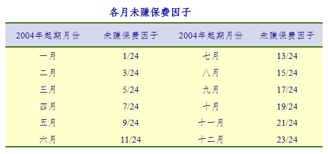{width="450"}

### 比例法：三百六十五分之一法

$\frac{保险止期-准备金评估日}{保险止期-保险起期}*保费收入$

### 风险分布法：七十八法则与逆七十八法则

-   假设：

    -   对于七十八法则，自承保起期开始后，风险的发生呈现逐月等额递减的趋势。对一年期的保单，自承保起期开始，在每月内的风险以比例$12:11:10:……$逐月递减。$12+11+…+1=78$。
    -   对于逆七十八法则，自承保起期开始后，风险以比例$1:2:3:……$逐月等额递增。

-   应用：

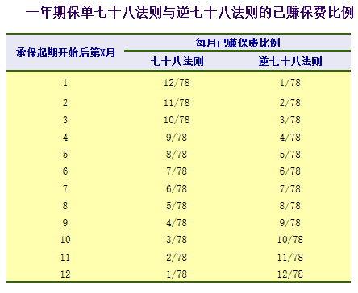{width="450"}

-   问题：

    -   对于一个两年期保单，如何应用类似于七十八法则的方法估计未到期责任准备金？
    -   分母将会是 $24+23+…+1=300$
    -   对应的已赚保费分别为：$24/300、23/300…$

### 风险分布法：流量预期法

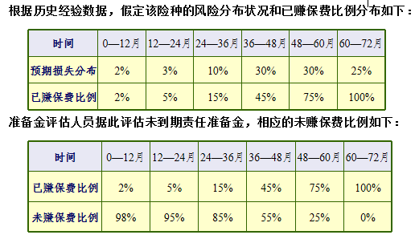{width="450"}

例： 假设某公司 2014 年四个季度财产保险的保费收入依次为 500 万元、230万元、320万元、100万元，假定保费收入呈现均匀分布，请分别按照下列方式计提 2014 年末的未到期责任准备金。 （1）按季平均法（1/8 法） （2）按年平均法（1/2 法） 答案： - 按季平均法（1/8 法） 500×（1/8）+ 230×（3/8）+ 320×（5/8）+ 100×（7/8） = 436.25（万） - 按年平均法（1/2 法） （500 + 230 + 320 + 100） ×（1/2）= 575 万

## 未决赔款准备金评估

未决赔款准备金的概念：

-   **已发生已报案未决赔款准备金**：保险事故已经发生并已向保险公司提出索赔，保险公司尚未结案。

-   **已发生未报案未决赔款准备金（IBNR）**：狭义上是指保险事故已经发生，但尚未向保险公司提出索赔。广义上还包括：

    -   已报案但尚未进入理赔程序的准备金
    -   重立赔案的准备金
    -   已发生已报案未决赔款准备金在未来的发展变化

-   **理赔费用准备金**：为尚未结案的赔案可能发生的费用而提取的准备金，可分为

    -   直接理赔费用准备金
    -   间接理赔费用准备金

常用的未决赔款准备金评估方法 - 链梯法 - 案均赔款法 - 准备金进展法 - B-F法 - 广义线性模型（Generalized Linear Models）

### 链梯法

-   基本假设：每个事故年的赔款支出具有相同的发展模式

-   基本方法：

    -   使用已付赔款数据，已付赔款链梯法
    -   使用已报案赔款数据，已报案赔款链梯法

-   扩展：已发生已报案未决赔款准备、已报案案件数、已结案件数、案均赔款

-   应用最为广泛的准备金评估方法之一

-   基本思想："平均"和"稳定"，依据流量三角形各列的比例关系来外推未来的赔款

    -   链：后一年与前一年的比率逐年构成
    -   梯：精算人员沿着"链"向上攀登，从历史数据中一步步预测未来的最终赔款

步骤：

***流量三角形***

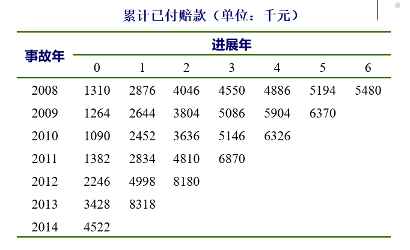{width="450"}

***进展因子***

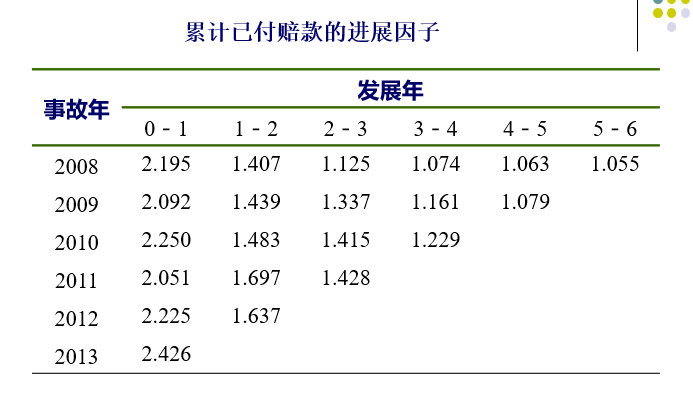{width="450"}

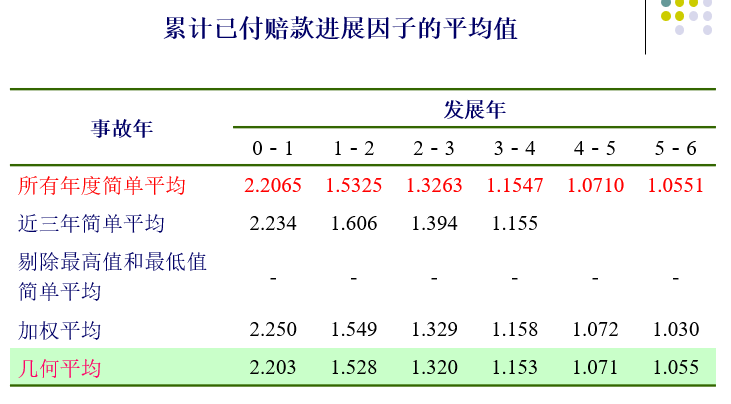{width="450"}

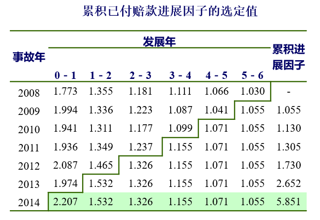{width="450"}

***最终赔款***

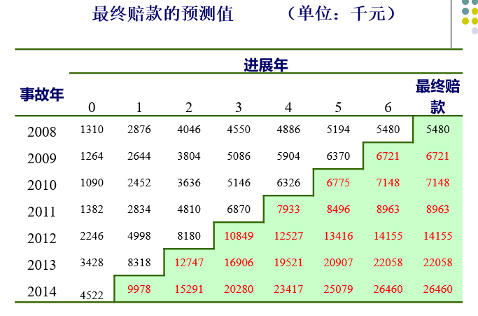{width="450"}

***未决赔款准备金***

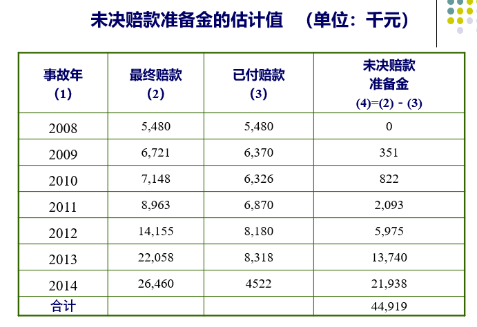{width="450"}

-   说明：

    -   进展因子：age-to-age ratio、report-to-report ratio、link ratio、loss development factor (LDF)

    -   已付赔款：赔案实际支付额，客观性较强；没有利用已报案未决赔款准备金的信息；受理赔速度的影响，理赔部门处理赔案的速度每年都可能发生变化，导致赔付延迟模式和进展因子波动较大；基于已付赔款数据的准备金评估会因为理赔速度的变化而被歪曲

-   对链梯法的批评

    -   从统计的角度看，它是不完善的，因为把一些非独立的数学期望值（进展因子）进行了连乘。事实上，进展因子之间是负相关的

    -   对观察值波动的反应异常敏感

    -   忽略了外生变量对流量三角形可能产生的影响，如理赔速度

-   链梯法的步骤

    -   累积赔款的流量三角形数据（ 已付赔款或已报案赔款等...） - - 计算逐年进展因子
    -   计算逐年进展因子的平均值（重点）和累积进展因子
    -   预测流量三角形中下三角部分的数值，得到最终赔款
    -   估计未决赔款准备金：最终赔款-累积已付赔款

-   链梯法在R软件中的应用

```{r}
library(data.table)
library(ggplot2)
library(ChainLadder)

# 读取数据
# 矩阵形式
cum.triangle <- matrix(data=c(1130,2003,2715,3206,3563,3798,3911,
                              1103,2199,2937,3592,3904,4064,0,
                              1008,1957,2566,3021,3320,0,0,
                              965,1868,2520,3117,0,0,0,
                              1028,2145,3142,0,0,0,0,
                              850,1678,0,0,0,0,0,
                              567,0,0,0,0,0,0),
                       nrow = 7,ncol = 7,byrow = TRUE)
colnames(cum.triangle) <- seq(0,6)   # 重命名（列名称）
row.names(cum.triangle) <- seq(1998,2004) # 重命名（行名称）
cum.triangle

# 将数据（矩阵形式）转化为（数据框形式）
claims <- 0
for(i in 1:7){
  for (j in 1:7){
    obs <- (i-1)*7 + j
    claims[obs] <- cum.triangle[i,j]
  }
}
dt <- data.table(i = rep(1998:2004, each = 7), 
                 j = rep(0:6, 7), 
                 claims = claims)
dt$i.f <- factor(dt$i)
dt$j.f <- factor(dt$j)
dt.upper <- dt[i + j <= 2004]  # 上三角的数据集（建模的数据集）
dt.lower <- dt[i + j > 2004]   # 下三角的数据集（需要预测的数据集）


# 画图进行初步分析
p1 <- ggplot(data = dt.upper, aes(x = j.f, y = claims, group = i.f, col = i.f)) + 
  geom_line() + 
  geom_point() + 
  theme_bw() + 
  xlab('事故年') + ylab('累积赔款')
p1

#计算公式
n <- ncol(cum.triangle)
ratio.f <- function(i){ 
  # 进展因子：加权平均数
  sum(cum.triangle[1:i, n-i+1] ) / sum(cum.triangle[1:i, n-i])
}
ratio <- sapply((n-1):1, ratio.f)
tail <- 1  # 尾部进展因子
ratio <- c(ratio, tail)

full.triangle <- cum.triangle
for(k in 1:(n-1)){
  full.triangle[(n-k+1):n, k+1] <- full.triangle[(n-k+1):n,k]*ratio[k]
}
full.triangle
ultimate.paid <- full.triangle[,n]  # 最终赔款
ultimate.paid
claim.paid <- 0
for(i in 1:7){
  claim.paid[i] <- cum.triangle[i, 8 - i]
}
claim.paid
ultimate.paid - claim.paid
Total.res <- sum(ultimate.paid - claim.paid)
Total.res

#运用 ChainLadder 包进行链锑法的估计和预测

m0 <- ata(cum.triangle)
# Volume weighted average age-to-age factor
attr(m0, 'vwtd')
# Volume simple average age-to-age factor
attr(m0, 'smpl')
ratio <- attr(m0, 'vwtd') # 进展因子（加权平均）
ratio <- cumprod(ratio) # 累积进展因子
tail <- 1  # 尾部进展因子
ratio <- c(ratio, tail)

full.triangle <- cum.triangle
n <- 7
for(k in 1:(n-1)){
  full.triangle[(n-k+1):n, k+1] <- full.triangle[(n-k+1):n,k]*ratio[k]
}
full.triangle
```

### 案均赔款法

链梯法只考虑了赔款的货币信息，没有考虑案件数的影响： 已报案案均赔款（payments per claim incurred, PPCI） 已结案案均赔款（payments per claim finalized, PPCF ）

案均赔款法包括已付案均赔款法和已报案案均赔款法。

-   定义：用链梯法分别估计出各事故年的最终案件数与案均赔款，再计算各事故年的最终赔款和未决赔款准备金。

-   基本假设：不同事故年的案均赔款是相对稳定的。

-   案均赔款：赔款÷案件数

    -   对案件数的估计：既可以采用已付案件数流量三角形，也可以采用已报案案件数流量三角形。

    -   对案均赔款的估计：用已付案均赔款流量三角形，或已报案案均赔款流量三角形。

**1、已付案均赔款法 （数据结构）**

***（1）流量三角形 -- 累计已付赔款***

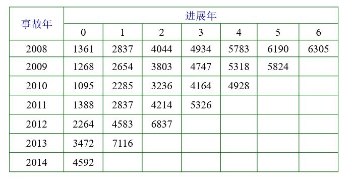{width="450"}

***（2）流量三角形 -累积已付案件数***

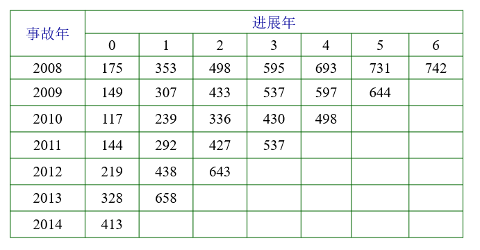{width="450"}

***（3）流量三角形 - 已付案均赔款***

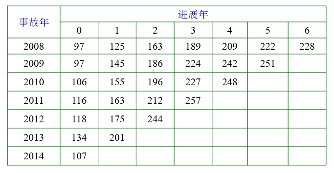{width="450"}

已付案均赔款 = 累积已付赔款÷累积已付案件数

**2、进展因子**

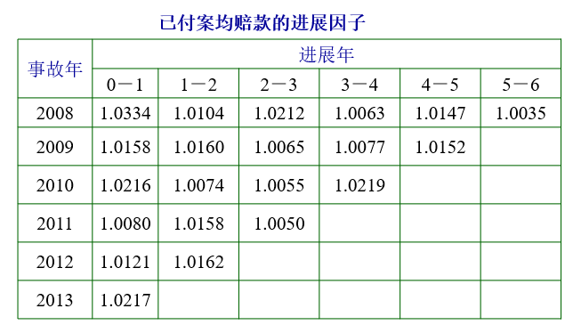{width="450"}

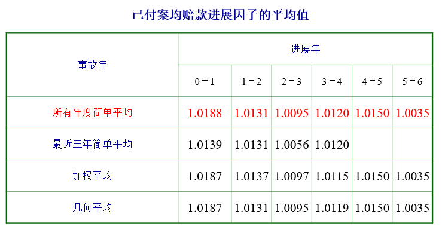{width="450"}

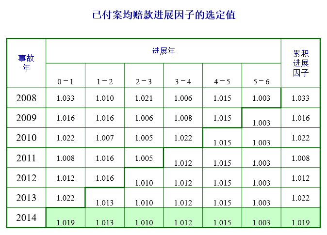{width="450"}

***（3）已付案均赔款***

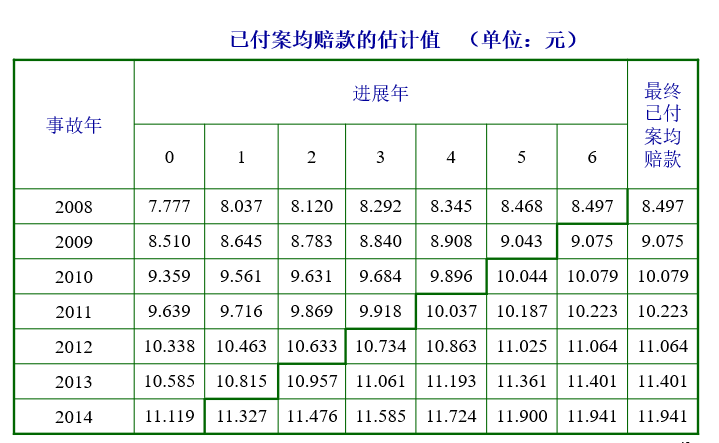{width="450"} 

***（4）未决赔款准备金***

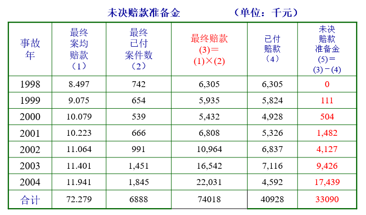{width="450"}

-   案均赔款法总结：

    -   （1）构造已付案件数（或已报案案件数）的流量三角形；
    -   （2）应用链梯法预测最终已付案件数（或已报案案件数）；
    -   （3）构造已付案均赔款（或已报案案均赔款）的流量三角形；
    -   （4）应用链梯法，预测最终的已付案均赔款（或已报案案均赔款）；
    -   （5）用最终已付案件数（或已报案案件数）乘以最终已付案均赔款（或已报案案均赔款），求得最终赔款；
    -   （6）从最终赔款中减去累积已付赔款，即得未决赔款准备金的预测值。

### 准备金进展法

-   定义：基于已付赔款和已发生已报案未决赔款准备金之间的关系。也被称作逐案估计预测法。

-   分类：

    -   报案年准备金进展法：只能对已发生已报案未决赔款准备金的充足性进行评价，但并不能估计未决赔款准备金。 （略）
    -   事故年准备金进展法

**准备金支付率**

-   已付赔款与已报案未决赔款准备金的比例

$$准备金支付率=\frac{c_{i,j+1}}{a_{i,j}}$$

-   对于某一事故年，在上一个进展年末预留的准备金是为了支付以后各进展年内的赔款
-   （理想状态）每个年末预留的准备金应等于下一年内应该支付的赔款 + 下一年末应提取的已报案未决赔款准备金

$$a_{i,j}=c_{i,j+1}+a_{i,j+1}$$

**准备金结转率**

-   第$i$事故年发生的赔款在第$j+1$进展年末计提的已报案未决赔款准备金与第$j$进展年末提取的已报案未决赔款准备金的比例 $$准备金结转率=\frac{a_{i,j+1}}{a_{i,j}}$$
-   相当于 - 已报案未决赔款准备金的进展因子

**准备金结转率和支付率的关系**

-   准备金结转率 + 准备金支付率 = 1 ： 进展年年初的已报案未决赔款准备金用于支付本年赔款后，剩余部分恰好全部转为本年末的已报案未决赔款准备金
-   准备金结转率 + 准备金支付率 \< 1 ： 年初准备金过多，除了应对本年的赔款和转入年末准备金外，还有剩余
-   准备金结转率 + 准备金支付率 \> 1 ： 年初准备金不足

基本原理

-   核心：估计准备金支付率和准备金结转率

-   思想：沿着两条链进行

    -   由准备金结转率得到已报案未决赔款准备金的估计值
    -   由准备金支付率得到已付赔款的预测值
    -   得到最终赔款预测值 + 未决赔款准备金的估计值

2、事故年准备金进展法

***（1）流量三角形***

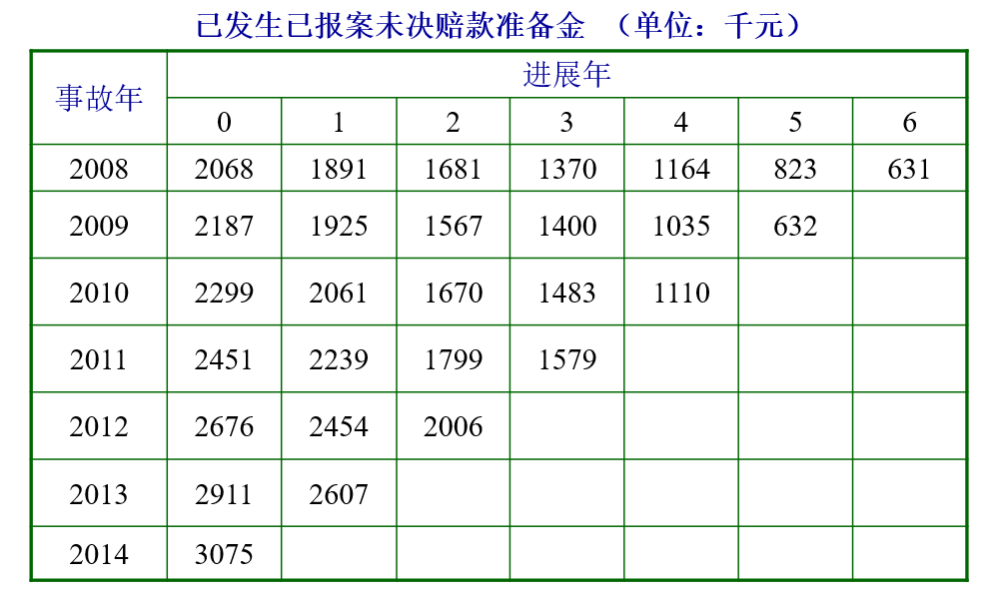{width="450"}

***（1）流量三角形 -- 当年的赔款（非累积赔款）***

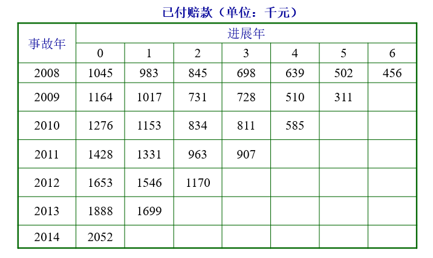{width="450"}

***（2）计算进展因子***

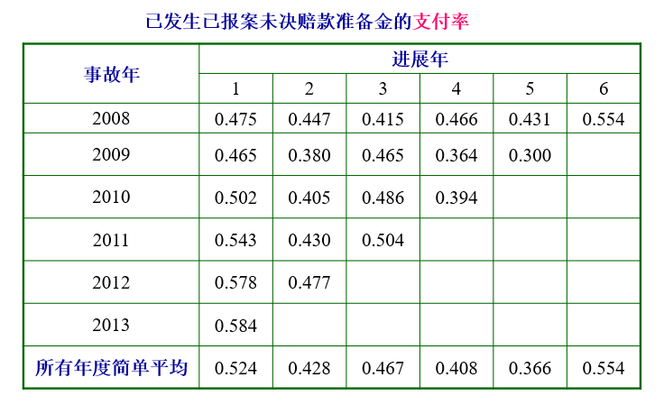{width="450"}

支付率=某个事故年和进展年的已付赔款÷相同事故年在前一个进展年的已发生已报案未决赔款准备金

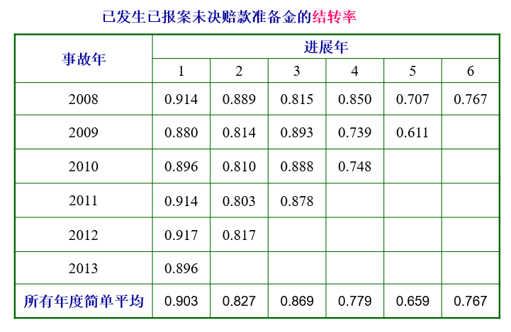{width="450"}

注：结转率=已发生已报案未决赔款准备金的逐年进展因子

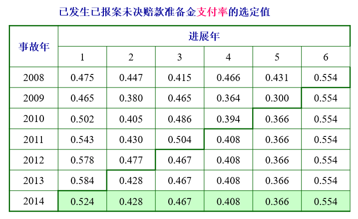{width="450"}

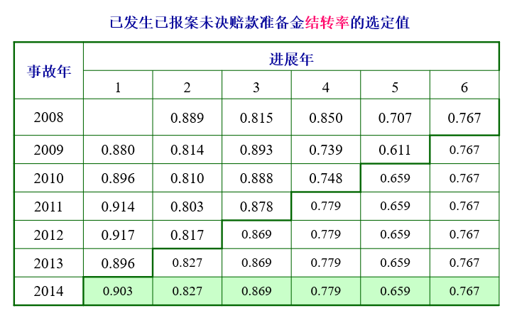{width="450"}

***（3）估计最终赔款***

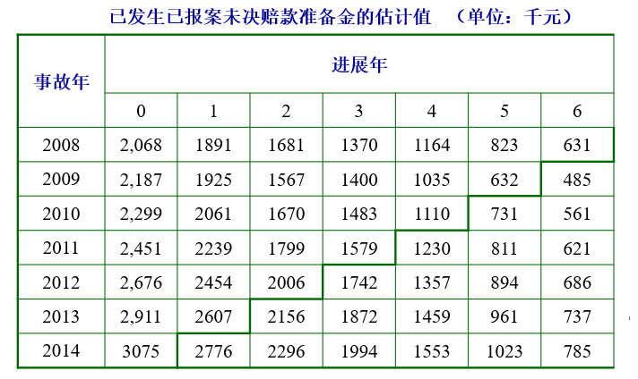{width="450"}

注：以2010事故年为例，在第4个进展年的已发生已报案未决赔款准备金为1110，而它在第5个进展年的结转率为0.659，因此在第5个进展年的已发生已报案未决赔款准备金为 1110 × 0.659 ＝ 731

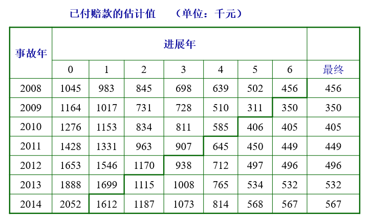{width="450"}

注：以2010事故年为例，它在第4个进展年的已发生已报案未决赔款准备金为1110，而在第5个进展年的支付率为0.366，因此在第5个进展年的已付赔款为 1110×0.366 ＝ 406.26

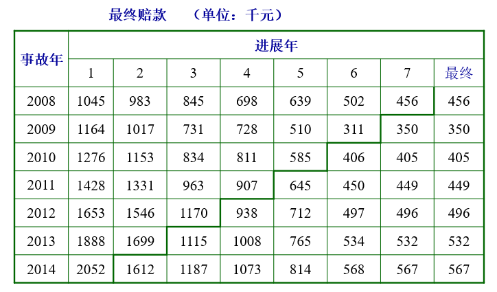{width="450"}

***（4）估计未决赔款准备金***

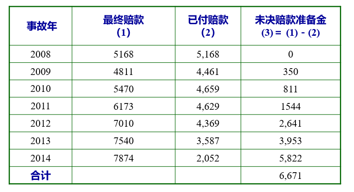{width="450"}

准备金进展法总结

-   （1）构造已付赔款和已发生已报案未决赔款准备金的流量三角形；
-   （2）用各个事故年和进展年的已付赔款观察值除以同一个事故年在前一个进展年的已发生已报案未决赔款准备金，求得已发生已报案未决赔款准备金的支付率，并计算和选定各个进展年的平均支付率；
-   （3）用各个事故年和进展年的已发生已报案未决赔款准备金除以同一个事故年在前一个进展年的已发生已报案未决赔款准备金，求得已发生已报案未决赔款准备金的结转率，并计算和选定各个进展年的平均结转率；
-   （4）用选定的结转率乘以相应的已发生已报案未决赔款准备金，即可求得已发生已报案未决赔款准备金的预测值；
-   （5）用选定的支付率乘以相应的已发生已报案未决赔款准备金，即可求得已付赔款的预测值；
-   （6）从最终累积已付赔款的预测值中减去当前的累积已付赔款，即得未决赔款准备金的预测值。

### B-F法

未决赔款准备金评估方法

-   定量，以数据、方法、模型为主，以索赔数据充足且具有统计稳定性为条件。如：链梯法、损失进展法、案均赔付法。
-   定性，依赖于精算师的经验和判断（数据较少）。如赔付率法，根据历史赔付率，结合精算师的经验确定最终赔付率，运用最终赔付率与已赚保费得到最终赔款的准备金。

**B-F（Bornhuetter-Ferguson）方法**：链梯法和赔付率法的结合（加权的思想），通过已付赔款（或已报案赔款）及其在未来的期望进展估计最终赔款。

基本步骤：

-   （1）估计期望最终赔款。等于期望最终赔付率乘以事故年的已赚保费。

    -   期望最终赔付率可以根据行业平均水平、本公司的赔付率进展趋势等因素进行估计
    -   数据有限，可以运用可信度进行调整

-   （2）对期望最终赔款进行修正。 $$修正后的最终赔款＝已付赔款＋期望最终赔款*（1－1/f）$$ 其中$f$为已付赔款的累积进展因子，即：$已付赔款*f＝最终赔款$。

$$
\begin{aligned}
修正后的最终赔款&= 已付赔款+期望最终赔款*(1-\frac{1}{f})\\
&=已付赔款*f*\frac{1}{f}+期望最终赔款*(1-\frac{1}{f})\\
&=链梯法估计的最终赔款*\frac{1}{f}+期望最终赔款*(1-\frac{1}{f})
\end{aligned}
$$

（3） 未决赔款准备金＝修正后的最终赔款－已付赔款 =期望最终赔款×（1－1 / f ） 
$$
\begin{aligned}
未决赔款准备金&= 修正后的最终赔款－已付赔款\\
&=期望最终赔款*(1-\frac{1}{f})
\end{aligned}
$$

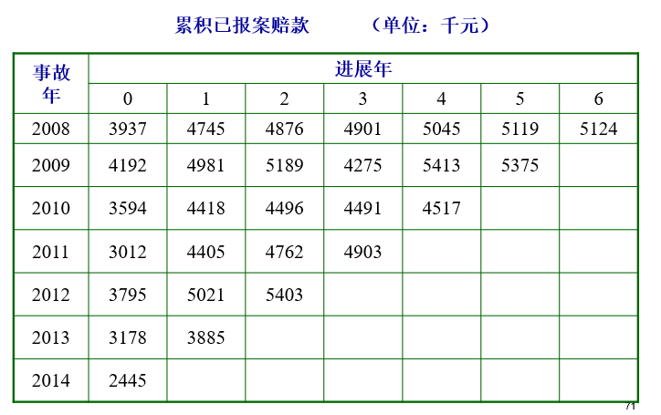{width="450"}

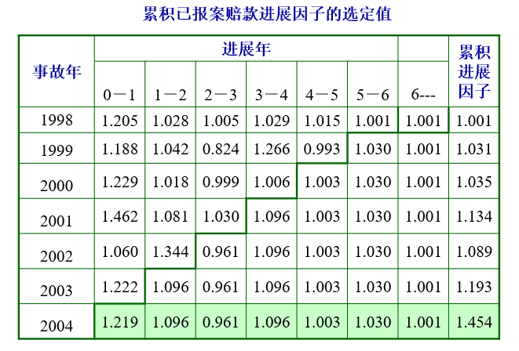{width="450"}

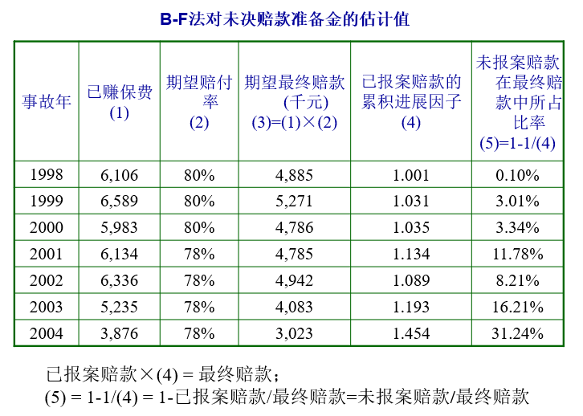{width="450"}

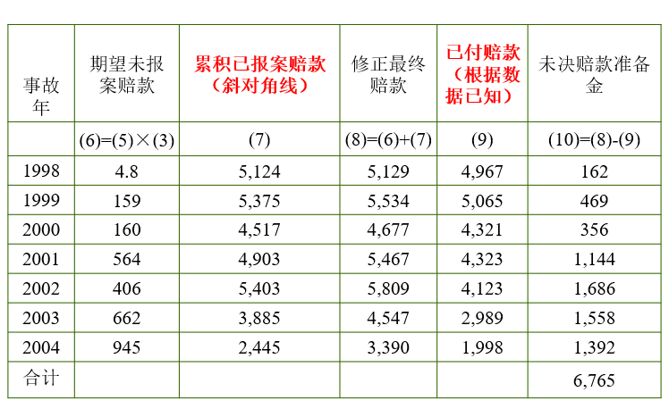{width="450"}

-   B-F方法的优点：不会受到异常损失结果的影响（例子）
-   B-F的最终赔款＝链梯法的最终赔款×（1/f）＋期望最终赔款×（1－1/f）

**练习：**

下表是某业务 2010-2013 年已付赔款的部分信息，各年的预期赔付率均为 80%，请用链梯法和 B-F 法分别估计 2013 年末的未决赔款准备金。

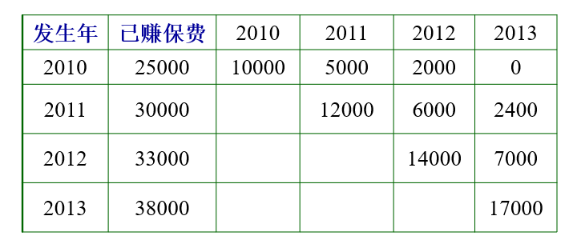{width="450"}

答案：

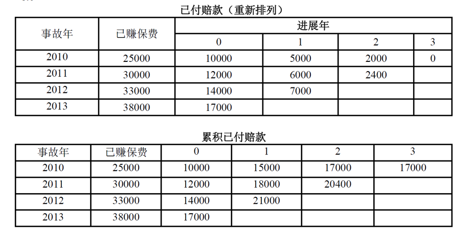{width="450"}

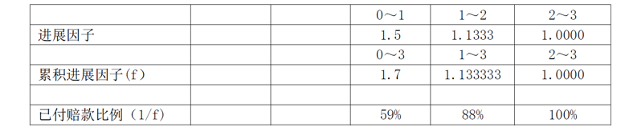{width="450"}

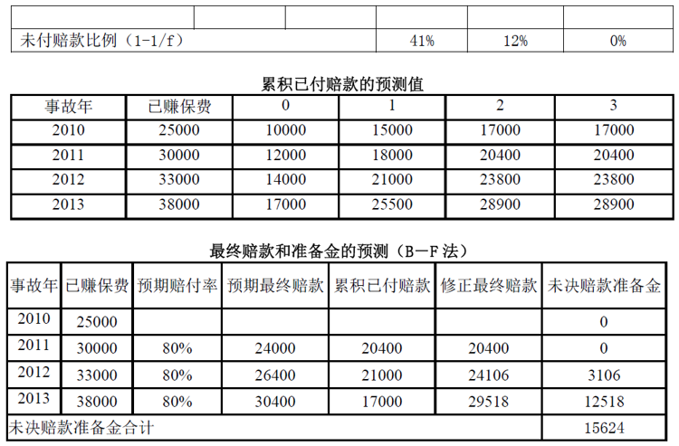{width="450"}

<!--chapter:end:08-reserving.Rmd-->

# Methods

We describe our methods in this chapter.

Math can be added in body using usual syntax like this 

## Math example

$p$ is unknown but expected to be around 1/3. Standard error will be approximated

$$
SE = \sqrt(\frac{p(1-p)}{n}) \approx \sqrt{\frac{1/3 (1 - 1/3)} {300}} = 0.027
$$

You can also use math in footnotes like this^[where we mention $p = \frac{a}{b}$].

We will approximate standard error to 0.027[^longnote]

[^longnote]: $p$ is unknown but expected to be around 1/3. Standard error will be approximated

$$
SE = \sqrt(\frac{p(1-p)}{n}) \approx \sqrt{\frac{1/3 (1 - 1/3)} {300}} = 0.027
$$

<!--chapter:end:method.Rmd-->

`r if (knitr:::is_html_output()) '
# References {-}
'`

<!--chapter:end:references.Rmd-->

